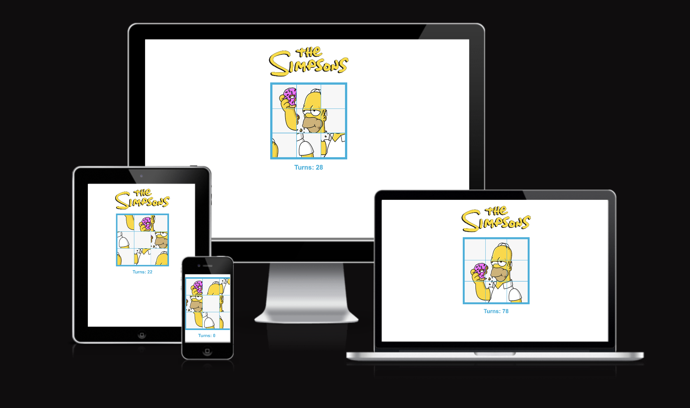
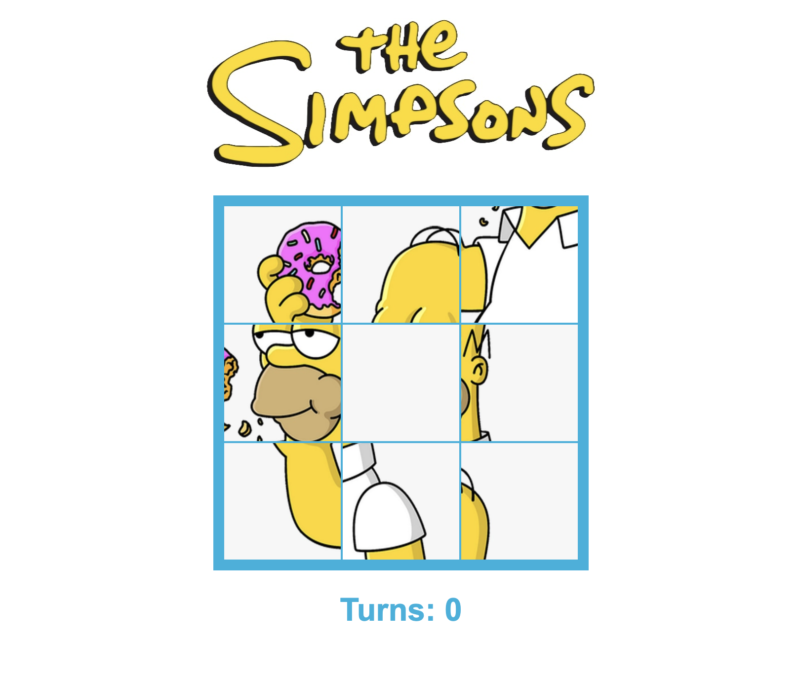
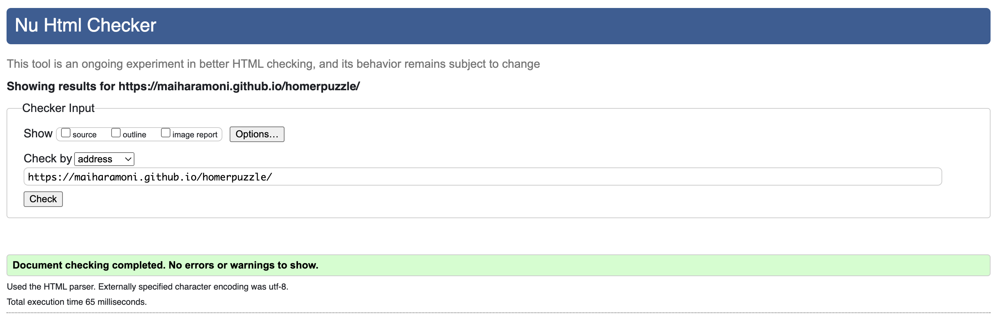
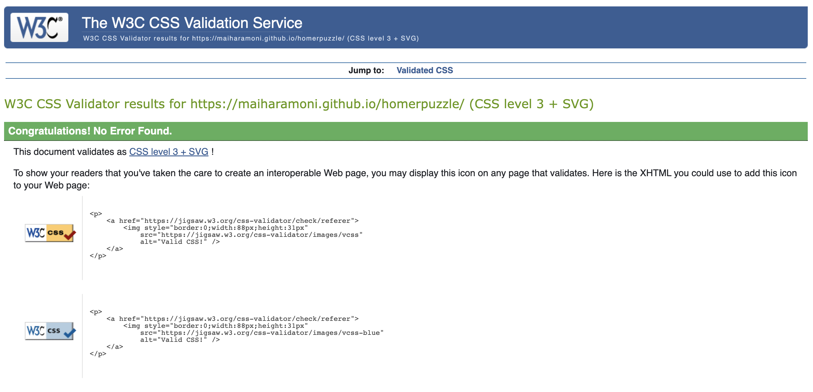
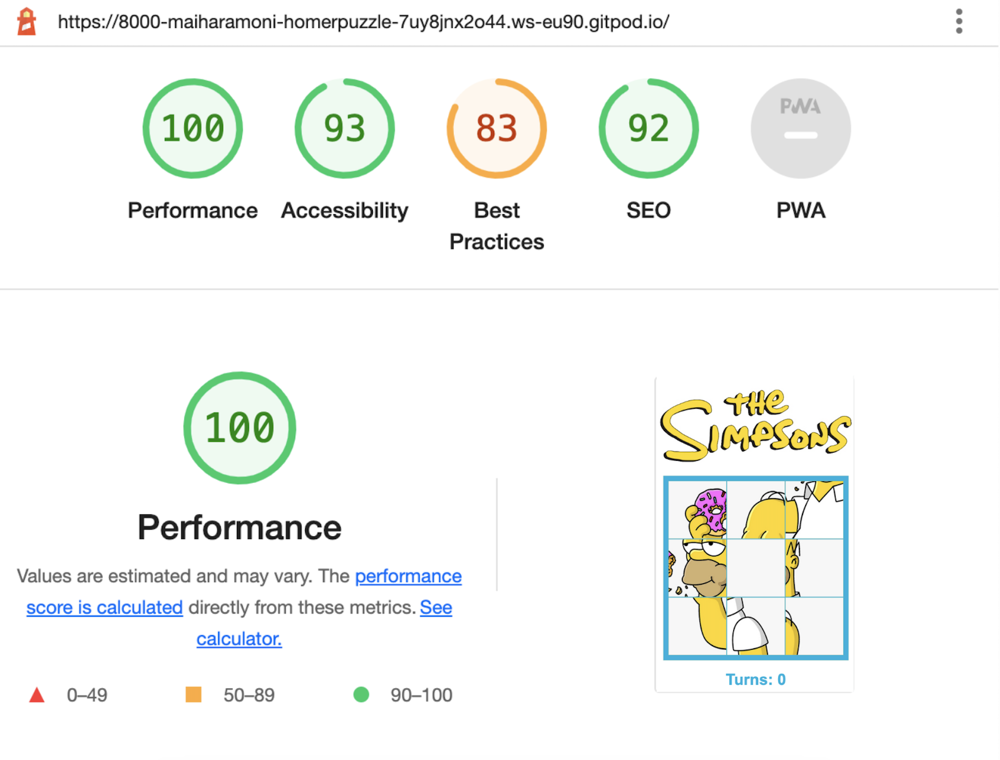
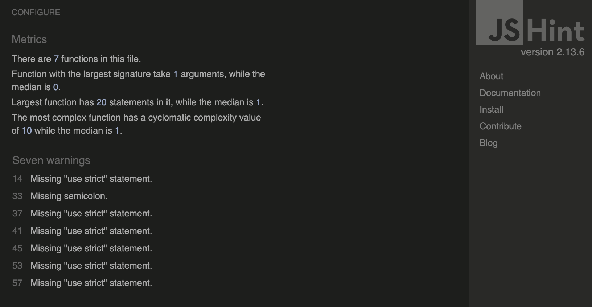

# SOLVE THE PUZZLE 🧩

## About

The Simpson's Puzzle is a game made with the intention of distracting and helping the brain solve the problem while Homer tries to eat his donut.

--------------------
## Design

The choice of simple design was made because I didn't want to create a big contrast between the background and the game and I decided to choose to leave only the official colors of The Simpsons design.

### Color Scheme:

The palette was defined trough search on the [Image Color Picker](https://imagecolorpicker.com/en) 

### Typography: 

I used the already available and standard fonts like Arial, Helvetica, sans-serif.

--------------------
## Technologies Used

* HTML
  * This project uses HTML to structure the website.

* CSS
  * This project uses CSS to style the website.

* JavaScript
  * This project uses JavaScript to execute the game functions.

* GitHub Pages
  * This project uses GitHub pages to host the website.

---------------------
## Validator Testing

### HTML

No errors were returned when passing through the official W3C validator.

### CSS

No errors were returned when passing through the official (Jigsaw) validator.

### Lighthouse

The Lighthouse validator shows a 83% rated on Best Practices saying that 'Displays images with incorrect aspect ratio' but I can’t change without changing the whole game.

### JShint

JSHint shows only seven warnings.

-------------------------
## Deployment

### Remote Deployment
* The site was deployed to GitHub pages. The steps to deploy are as follows:
  1. In the GitHub repository, navigate to the Settings tab
  2. On the left side menu, on the section Code and automation, click on Pages.
  3. From the source section drop-down menu, select the Deploy from a branch.
  4. From the branch section drop-down menu, select main, right on the side select /root.
  5. Once the the branch menus have been selected, github will create the page. It might take a few minutes. Once it is done a link will show up on the top of the page.

The live link can be found here - [Homer Puzzle](https://maiharamoni.github.io/homerpuzzle/)

### Clone/Forking
* To fork this site go to its GitHub repository [Hommer Puzzle](https://maiharamoni.github.io/homerpuzzle/)
  1. On the top right of the page there's a button with the option Fork, click on it.
  2. A new page "Create a new fork" will open. If you wish, you can edit the name.
  3. In the end of the page click on the button "Create fork".
  4. Now you have a copy of the project on your repositories.

### Local Deployment
* This site was developed using Gitpod. To edit your copy on Gitpod you will need to:
  1. On your browser of choice install the gitpod extension/add-on.
  2. On GitHub open the project repository you forked before.
  3. On the top of the page, over the files, there is a green button on the right side of the page saying "Gitpod". Click it.
  4. It will open the Gitpod website. On the first time, you will select to connect with your GitHub account and Authorize gitpod-io. 
  5. After that you'll be creating an account.
  6. It might take a while after that because gitpod will be creating your workspace.
  7. After the workspace is loaded, you're able to edit it on Gitpod.

-----------------------

## Credits

* Inspired on the character Homer from The Simpsons™ by [Disney](https://www.disneyplus.com)

* The Simpsons™ is a trademark logo and this use is for educational and non-profit purposes only.

* Logo was taken from [Wikipedia](https://en.wikipedia.org/wiki/The_Simpsons)

### The following videos and websites have helped me and inspired me strongly:

* (https://codeguppy.com/site/tutorials/sliding-puzzle.html)

* (https://www.youtube.com/watch?v=b2K7eo5Jdj8&list=PLHz_AreHm4dlsK3Nr9GVvXCbpQyHQl1o1&index=19)

* (https://www.youtube.com/watch?v=jEf_zX4fKqU)

* (https://www.w3schools.com/js/js_let.asp)

* (https://www.youtube.com/watch?v=tONadwAs_Hw)